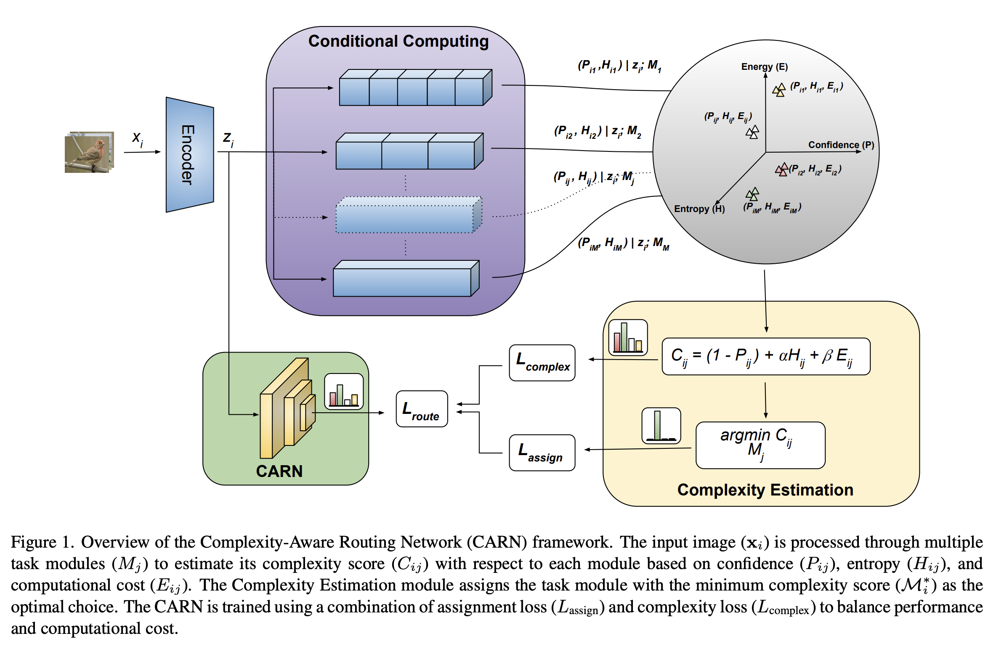
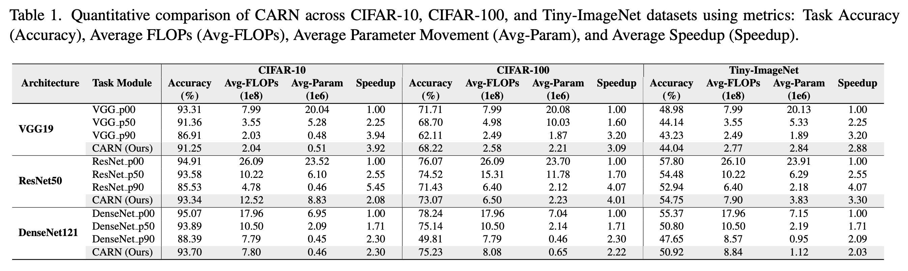
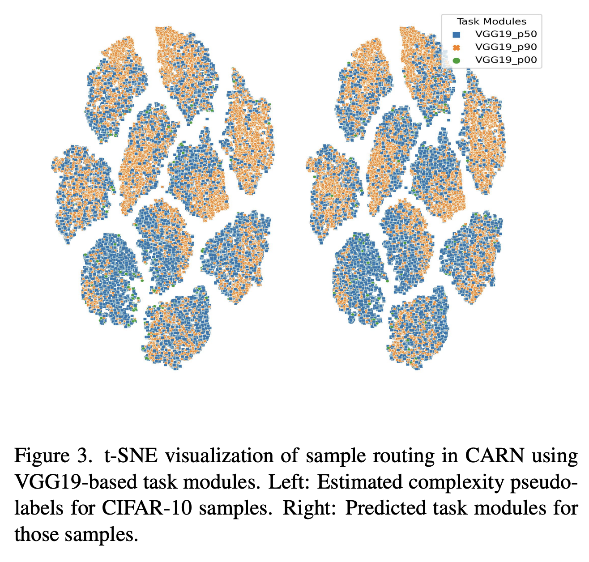

# CARN: Complexity-Aware Routing Network for Efficient and Adaptive Inference

Official PyTorch implementation of *“CARN: Complexity-Aware Routing Network for Efficient and Adaptive Inference”*.

**Authors**

- **Rebati Gaire**  
  University of Illinois Chicago, Chicago, Illinois  
  `rrgaire@uic.edu`
- **Arman Roohi**  
  University of Illinois Chicago, Chicago, Illinois  
  `aroohi@uic.edu`

---



## Abstract

Deep neural networks (DNNs) have achieved remarkable success across various domains, yet their rigid, static computation graphs lead to significant inefficiencies in realworld deployment. Standard architectures allocate equal computational resources to all inputs, disregarding their inherent complexity, which results in unnecessary computation for simple samples and suboptimal processing for complex ones. To address this, we propose the Complexity-Aware Routing Network (CARN), a novel framework that dynamically adjusts computational pathways based on input complexity. CARN integrates a self-supervised complexity estimation module that quantifies input difficulty using confidence, entropy, and computational cost, guiding a neural network-based routing mechanism to optimally assign task modules. The model is trained using a routing loss function that balances assignment accuracy and computational efficiency, mitigating expert starvation while preserving specialization. Extensive experiments on CIFAR10, CIFAR-100, and Tiny-ImageNet demonstrate that CARN achieves up to 4× reduction in computational cost and over 10× reduction in parameter movement while maintaining high accuracy compared to state-of-the-art static models.

---

## Repository layout

- `cifar10/`, `cifar100/`, `tinyimagenet/`: experiment code by dataset/backbone
- `test/`: minimal runnable example scripts
- `assets/`: figures and tables used in this README.

---

## Prerequisites

- Python **>= 3.9**
- PyTorch **>= 2.0** and torchvision (install the build appropriate for your system and CUDA runtime)

---

## Installation

Create an environment and install dependencies:

```bash
python -m venv .venv
source .venv/bin/activate
pip install --upgrade pip
pip install -r requirements.txt
```

Install PyTorch/torchvision separately if needed for your CUDA / platform (recommended). The remaining dependencies are captured in `requirements.txt`.

---

## Training

Experiments are organized by dataset and backbone. For a given dataset/backbone, the typical pipeline consists of:

1. **Individual training** (`indv/`): train the base feature extractor and the unpruned classifier.
2. **Pruning / expert construction** (`pruning/`, `pruning_v2/`, `pruned_v2/`): construct additional task modules (experts) at different compute budgets.
3. **Sampler training** (`sampler/`): train the routing network using the task modules and complexity-aware routing objectives.

Below are example commands for **CIFAR-10 / VGG-19**. The same structure is repeated under `cifar100/` and `tinyimagenet/` with corresponding backbones.

### 1) Individual training (base model)

```bash
python cifar10/vgg19/indv/main.py \
  --name C10_VGG19_INDV \
  --data_path path/to/data \
  --checkpoint_dir path/to/checkpoints \
  --log_dir path/to/logs
```

This stage writes:

- `path/to/checkpoints/C10_VGG19_INDV_fe.pth`
- `path/to/checkpoints/C10_VGG19_INDV_classifier.pth`

### 2) Pruning / expert construction

The pruning code uses the trained individual checkpoints as initialization and produces pruned classifier checkpoints (experts) at a given ratio.

```bash
python cifar10/vgg19/pruning_v2/prune.py \
  --name C10_VGG19 \
  --ratio 0.5 \
  --data_path path/to/data \
  --checkpoint_dir path/to/checkpoints \
  --log_dir path/to/logs
```

Run with multiple ratios (e.g., `0.5`, `0.9`) to obtain a set of experts. (If you adapt the pruning scripts to accept explicit `--fe_ckpt` / `--classifier_ckpt` flags, pass those here.)

### 3) Sampler (routing network) training

Provide the feature extractor and the three task modules (e.g., unpruned + two pruned experts) as checkpoint paths:

```bash
python cifar10/vgg19/sampler/main.py \
  --name C10_VGG19_RFC \
  --data_path path/to/data \
  --checkpoint_dir path/to/checkpoints \
  --log_dir path/to/logs \
  --fe_ckpt path/to/checkpoints/C10_VGG19_INDV_fe.pth \
  --classifier1_ckpt path/to/checkpoints/C10_VGG19_INDV_classifier.pth \
  --classifier2_ckpt path/to/checkpoints/path_to_pruned_expert_ratio_0.5.pth \
  --classifier3_ckpt path/to/checkpoints/path_to_pruned_expert_ratio_0.9.pth
```

---

## Testing (Inference)

Evaluation entrypoints live under the corresponding `*/sampler/test.py`.

Example (CIFAR-10 / VGG-19):

```bash
python cifar10/vgg19/sampler/test.py \
  --name C10_VGG19_RFC \
  --data_path path/to/data \
  --checkpoint_dir path/to/checkpoints \
  --log_dir path/to/logs \
  --task_model_ckpt path/to/checkpoints/task_model.pth \
  --sampler_ckpt path/to/checkpoints/C10_VGG19_RFC_sampler.pth
```

---

## Results

### Quantization results



### t-SNE visualization



---

## Citation

```bibtex
@inproceedings{gaire2025carn,
  title={Carn: Complexity-aware routing network for efficient and adaptive inference},
  author={Gaire, Rebati and Roohi, Arman},
  booktitle={Proceedings of the IEEE/CVF Conference on Computer Vision and Pattern Recognition},
  pages={3318--3326},
  year={2025}
}
```

